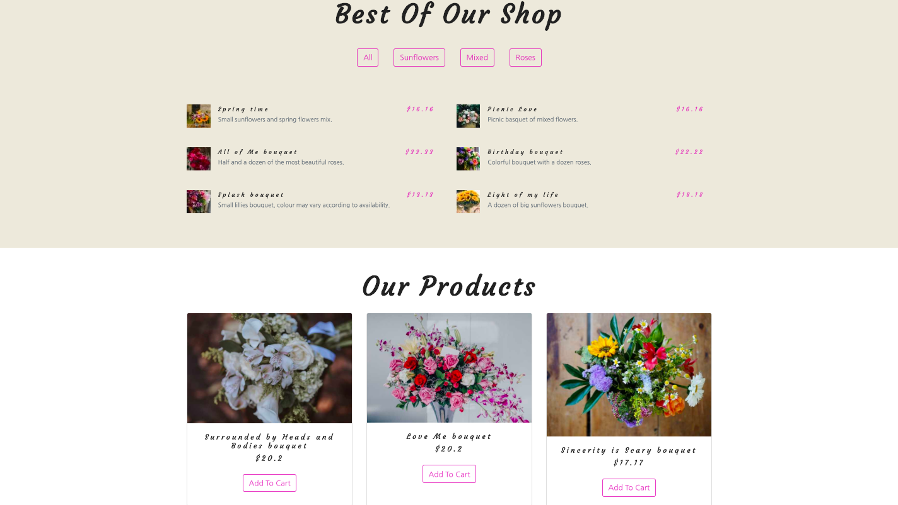

# 💻 Dulce's flower shop (BETA)

Building a flower shop website with Gatsby.js. This project also uses Contentful CMS and SnipCart for the shopping cart.



## ✨ Live Demo

You can look at it [here](https://gatsby-flower-project.netlify.com/).

## 🚀 Getting Started

To get a local copy up and running follow these simple example steps.

### Clone

```sh
git clone git@github.com:misselliev/gatsby-flower-project.git
cd gatsby-flower-project
```

### Install

```sh
npm install
```

### Usage

```sh
gatsby develop
```

## :pencil2: Todo
- Tests to be added.

## Author

👤 Elizabeth Villalejos

- [Github](https://github.com/misselliev)
- [Linkedin](https://linkedin.com/ellievillalejos)
- [Dev.to](https://dev.to/misselliev)
- [Twitter](https://twitter.com/miss_elliev/)
- [Instagram](https://www.instagram.com/miss_elliev/)
- [Email](mailto:elizabeth.villalejos@gmail.com?subject=Website%20Inquiry)

## 🤝 Contributing

Contributions, issues and feature requests are welcome!

Feel free to check the [issues page](issues/).

## Show your support

Give a ⭐️ if you like this project!

> “What simple action could you take today to produce a new momentum toward success in your life?” Tony Robbins
